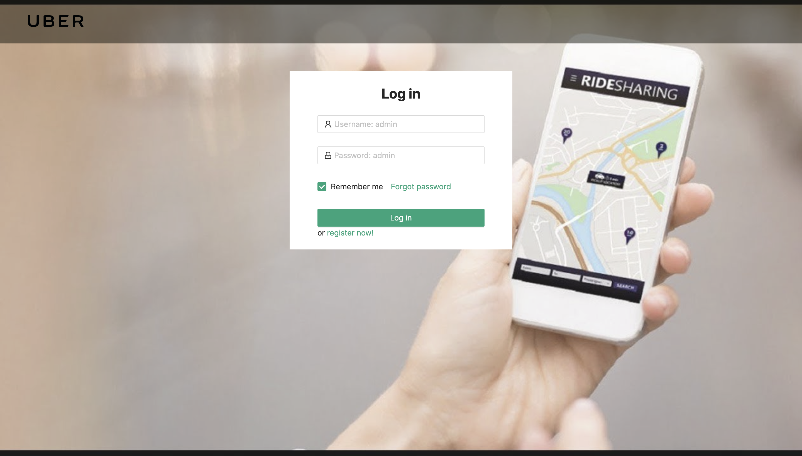
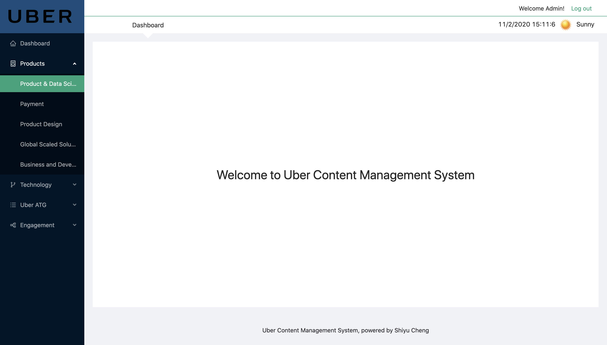

# Uber Dashboard for OA OCBang

## Install
#### Download the repository, then run snippets below:  
```javascript
npm install
npm start
```

## Authentication
#### account: admin
#### password: admin

# Showcase



